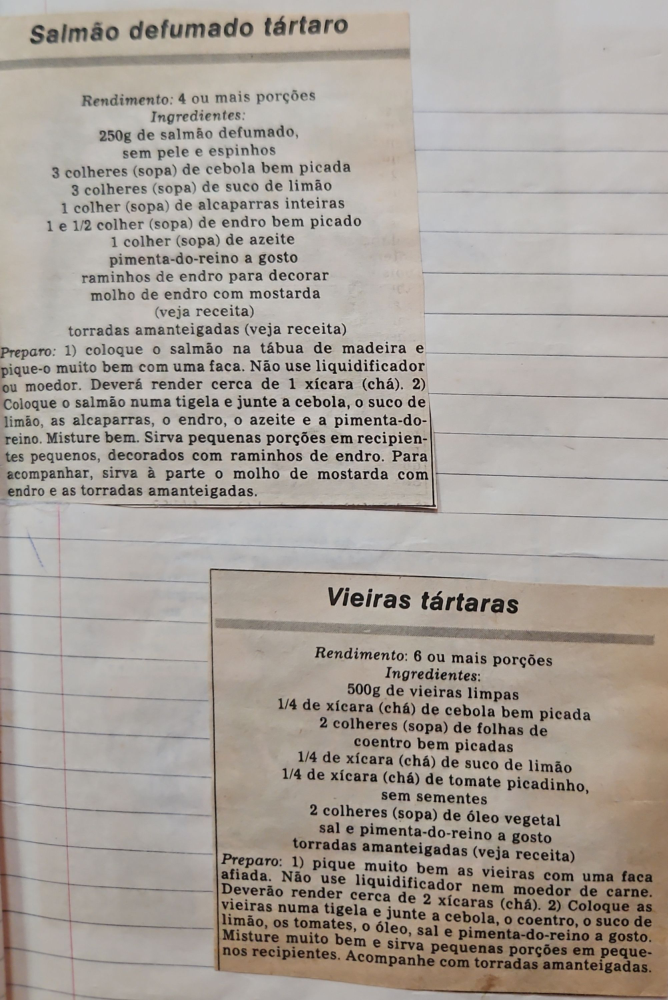

# Página 98
:::danger[NÃO REVISADO]
A página não foi revisada, portanto pode conter erros de digitação, formatação ou alucinações.
:::
## Salmão defumado tártaro

### Rendimento:
4 ou mais porções

### Ingredientes:

*   250g de salmão defumado, sem pele e espinhos
*   3 colheres (sopa) de cebola bem picada
*   3 colheres (sopa) de suco de limão
*   1 colher (sopa) de alcaparras inteiras
*   1 e 1/2 colher (sopa) de endro bem picado
*   1 colher (sopa) de azeite
*   pimenta-do-reino a gosto
*   raminhos de endro para decorar
*   molho de endro com mostarda (veja receita)
*   torradas amanteigadas (veja receita)

### Preparo:

1.  coloque o salmão na tábua de madeira e pique-o muito bem com uma faca. Não use liquidificador ou moedor. Deverá render cerca de 1 xícara (chá).
2.  Coloque o salmão numa tigela e junte a cebola, o suco de limão, as alcaparras, o endro, o azeite e a pimenta-do-reino. Misture bem. Sirva pequenas porções em recipientes pequenos, decorados com raminhos de endro. Para acompanhar, sirva à parte o molho de mostarda com endro e as torradas amanteigadas.

## Vieiras tártaras

### Rendimento:
6 ou mais porções

### Ingredientes:

*   500g de vieiras limpas
*   1/4 de xícara (chá) de cebola bem picada
*   2 colheres (sopa) de folhas de coentro bem picadas
*   1/4 de xícara (chá) de suco de limão
*   1/4 de xícara (chá) de tomate picadinho, sem sementes
*   2 colheres (sopa) de óleo vegetal
*   sal e pimenta-do-reino a gosto
*   torradas amanteigadas (veja receita)

### Preparo:

1.  pique muito bem as vieiras com uma faca afiada. Não use liquidificador nem moedor de carne. Deverão render cerca de 2 xícaras (chá).
2.  Coloque as vieiras numa tigela e junte a cebola, o coentro, o suco de limão, os tomates, o óleo, sal e pimenta-do-reino a gosto. Misture muito bem e sirva pequenas porções em pequenos recipientes. Acompanhe com torradas amanteigadas.

