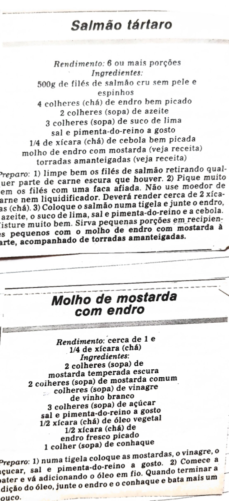

# Página 99
:::danger[NÃO REVISADO]
A página não foi revisada, portanto pode conter erros de digitação, formatação ou alucinações.
:::
## Salmão tártaro

### Rendimento
6 ou mais porções

### Ingredientes
- 500g de filés de salmão cru sem pele e espinhos
- 4 colheres (chá) de endro bem picado
- 2 colheres (sopa) de azeite
- 3 colheres (sopa) de suco de lima
- sal e pimenta-do-reino a gosto
- 1/4 de xícara (chá) de cebola bem picada
- molho de endro com mostarda (veja receita)
- torradas amanteigadas (veja receita)

### Preparo
1. limpe bem os filés de salmão retirando qualquer parte de carne escura que houver.
2. Pique muito bem os filés com uma faca afiada. Não use moedor de carne nem liquidificador. Deverá render cerca de 2 xícaras (chá).
3. Coloque o salmão numa tigela e junte o endro, o azeite, o suco de lima, sal e pimenta-do-reino e a cebola. Misture muito bem. Sirva pequenas porções em recipientes pequenos com o molho de endro com mostarda à parte, acompanhado de torradas amanteigadas.

## Molho de mostarda com endro

### Rendimento
cerca de 1 e 1/4 de xícara (chá)

### Ingredientes
- 2 colheres (sopa) de mostarda temperada escura
- 2 colheres (sopa) de mostarda comum
- 4 colheres (sopa) de vinagre de vinho branco
- 3 colheres (sopa) de açúcar
- sal e pimenta-do-reino a gosto
- 1/2 xícara (chá) de óleo vegetal
- 1/2 xícara (chá) de endro fresco picado
- 1 colher (sopa) de conhaque

### Preparo
1. numa tigela coloque as mostardas, o vinagre, o açúcar, sal e pimenta-do-reino a gosto.
2. Comece a bater e vá adicionando o óleo em fio. Quando terminar a adição do óleo, junte o endro e o conhaque e bata mais um pouco.

